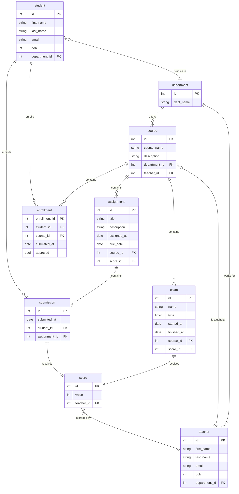

# be-exercise-guide
A guide for creating BE exercise using the standard use case

## Introduction
* In order to get familiar with writing different programming language and its respective framework, a common case study is being created here

## Scenario
* A simple 

## ERP Diagram
