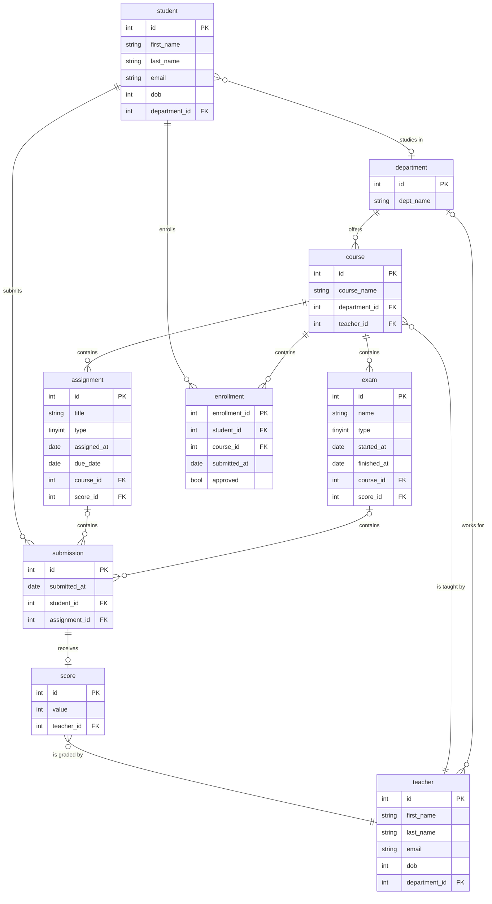

# be-exercise-guide
A guide for creating BE exercise using the standard use case

## Introduction
* In order to get familiar with writing different programming language and its respective framework, a common case study is being created here
* Common tools will be provided in this repo
    * migration script for DB table generation
        * currently only doing it for Postgres
    * seeder for populating DB with data
* The BE server only needs to connect to the created DB then implement the business logic accordingly to its own design

## Scenario
* A scenario that is commonly used that involves an university where there are students, teachers, courses, exams etc.
* Rules:
    * a teacher works for a department
    * a student studies in a department
    * a department have many courses
    * a student can enroll in many courses from different departments
    * only one teacher can teach in a course
    * a course can contain many students
    * a course can have many assignments
    * a course can have many exams
    * a student will make a submission for an assignment or an exam
    * a submission will be scored by a teacher

## ERP Diagram


## How to use
### Prerequisite
* install [go-migrate CLI](https://github.com/golang-migrate/migrate) (use install via brew if MacOS)
* have Docker installed so that we can use `docker-compose`

## Start up Postgres Server and create tables
* run `docker-compose up -d` to start up the postgres server (use `docker ps` to check)
* run the following command to create the tables
```bash
migrate -path ./db/postgres_migrations/ -database "postgres://<username>:<password>@<domain>:<port>/<DB_name>>?sslmode=disable" up
```

## Clean up Tables and shut down Postgres server
* run the following command to remove the tables
```bash
migrate -path ./db/postgres_migrations/ -database "postgres://<username>:<password>@<domain>:<port>/<DB_name>>?sslmode=disable" down
```
* run `docker-compose down` to shut down the postgres server (use `docker ps` to check)